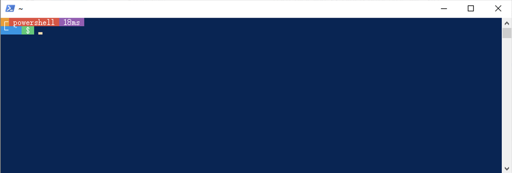
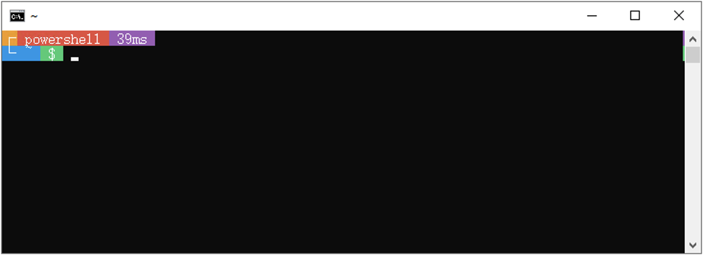
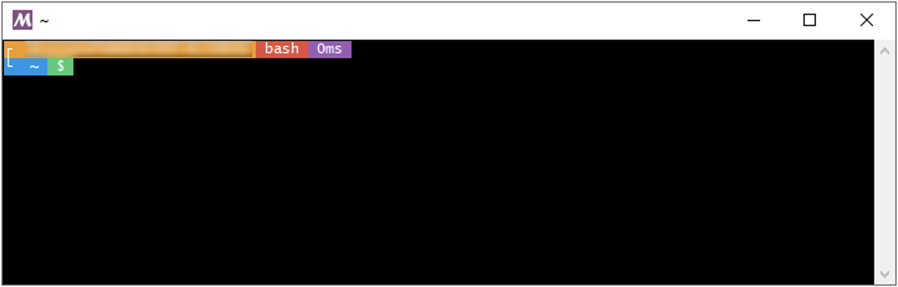
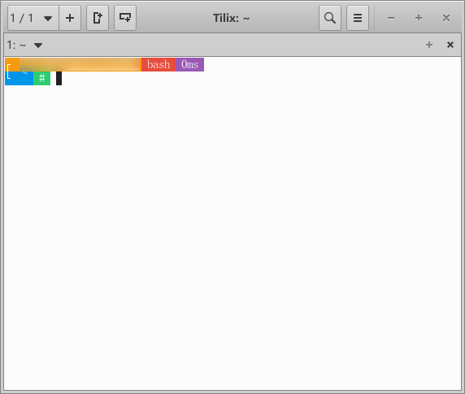
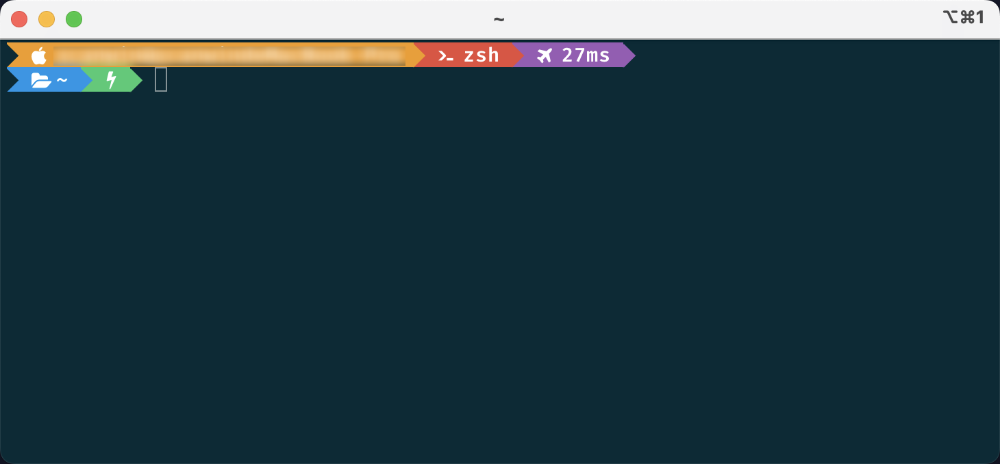
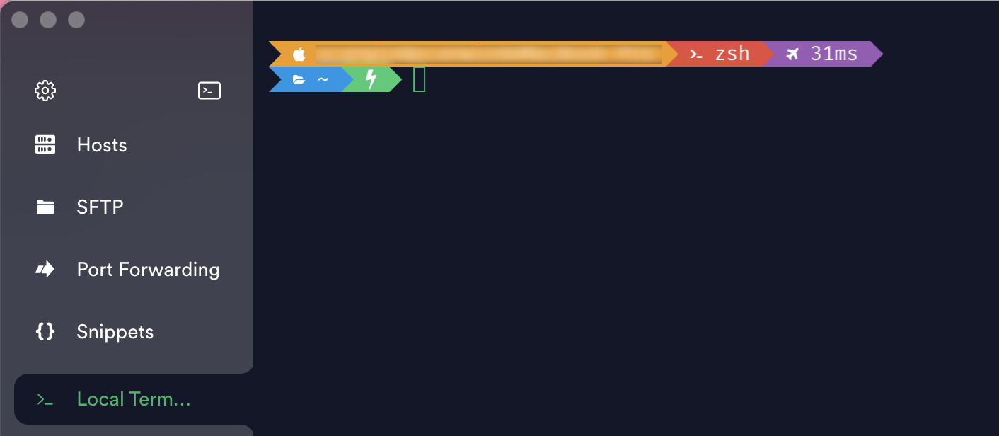
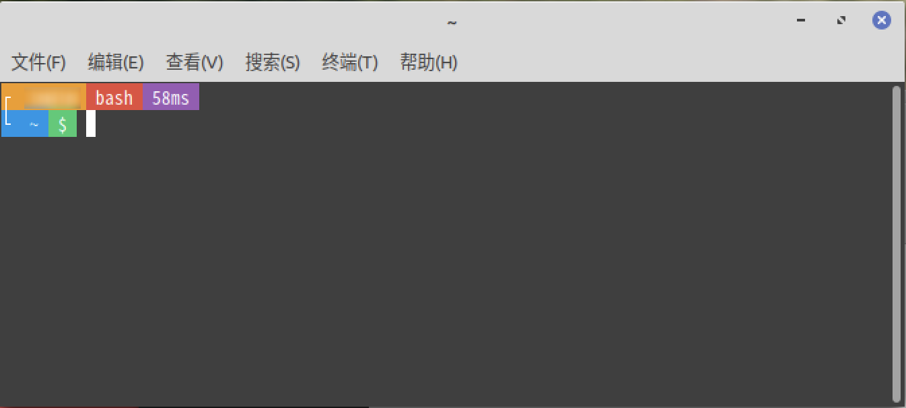

# xposh

<br>

## 项目简介

- 终端美化神器，精美的控制台oh-my-posh配色方案
- 兼容Windows、Linux、MacOS、Terminal、Powershell、CMD、MSYS、wsl、iTerm、Termius、VS Code、GNOME、bash、zsh等

<br>

## 优点

- 科学的展示
- 美观的色调
- 顺手修复官方BUG
- 兼容这些系统：Windows、MasOS、LinuxMint、Ubuntu
- 兼容这些终端：Windows Terminal、CMD、Powershell、MSYS、iTerm、Termius、GNOME、VS Code、Tilix、MacOS Terminal
- 兼容这些命令处理器：Powershell、bash、zsh
- 兼容以上所有系统、终端、命令处理器的各种混搭
- 兼容powershell5和powershell7的语法，共用一个powershell脚本，方便统一维护和二开
- 兼容bash和zsh的语法，共用一个linux shell脚本，方便统一维护和二开
- powershell和linux shell编码逻辑尽量一致，方便统一维护和二开
- omp主题和omp.minimal主题结构一致，方便统一维护和二开
- 非常适合强迫症患者维护和二开

<br>

## 效果图

| 系统 | 终端 | 命令处理器 | 展示 |
| --- | --- | --- | --- |
| Windows | Windows Terminal | Powershell |  |
| Windows | Powershell | Powershell |  |
| Windows | CMD | Powershell |  |
| Windows | MSYS | bash |  |
| Windows | Windows Terminal + MSYS | bash |  |
| Windows | wsl + Ubuntu + Tilix | bash |  |
| Windows | Windows Terminal + Ubuntu | bash |  |
| MacOS | iTerm | zsh |  |
| MacOS | Termius | zsh |  |
| MacOS | VS Code | zsh |  |
| LinuxMint | GNOME | bash |  |

<br>

## 安装方法

1. 安装字体
2. 安装xposh

<br>

## 安装字体

1. 所有系统都必须安装新字体
2. 访问链接 ```https://github.com/ryanoasis/nerd-fonts/releases/``` 下载 ```FiraCode.tar.xz```
3. 解压并双击 ```FiraCodeNerdFont-SemiBold.ttf``` 即可安装成功
4. 下面的步骤根据自身情况部署

<br>

## 安装xposh

### Linux

1. 执行以下命令
```
bash -c "`curl -fsSL https://github.com/xcanwin/xposh/raw/main/bin/xposh.install.sh`"
```

### MacOS + MacOS Terminal

1. 完成上述 ```Linux``` 步骤
2. 通过 brew 安装
```
brew install oh-my-posh
```
3. 新建 ```MacOS Terminal``` 窗口，即可生效

### MacOS + iTerm

1. 完成上述 ```MacOS + MacOS Terminal``` 步骤
2. 打开 ```iTerm```，点击 顶部iTerm，Settings，Profiles，Text，Font，选择 ```FiraCode Nerd Font```
3. 新建 ```iTerm``` 窗口，即可生效

### Windows + Powershell

1. 通过 powershell 安装
```
Set-ExecutionPolicy Bypass -Scope Process -Force;
Invoke-Expression ((New-Object System.Net.WebClient).DownloadString('https://ohmyposh.dev/install.ps1'));
```
2. 手动复制本项目中的主题文件 ```xposh.omp.json``` 和 ```xposh.minimal.omp.json```，执行以下命令，粘贴到弹出的目录中
```
$POSH_PATH = "$env:LOCALAPPDATA\Programs\oh-my-posh";
ni -it Directory "${POSH_PATH}\themes\" -f;
explorer "${POSH_PATH}\themes\";
```
3. 手动编辑本项目中的配置文件 ```xposh.powershell.ps1```，复制文本内容，关闭编辑器
4. 执行以下命令，粘贴上一步的文本内容到弹出的编辑器中，保存，关闭编辑器
```
Set-ExecutionPolicy RemoteSigned -Scope CurrentUser;
ni -it Directory (Split-Path $PROFILE) -f;
notepad "$PROFILE";
```
5. 关闭```powershell``` 窗口，新建 ```powershell``` 窗口，即可生效

### Windows + Windows Terminal

1. 完成上述 ```Windows + Powershell``` 步骤
2. 打开 ```Windows Terminal```，点击顶部设置
3. 配置文件，```默认值```，外观，字体，选择 ```FiraCode Nerd Font```
4. 配置文件，```Powershell```，外观，字体，选择 ```FiraCode Nerd Font```
5. 配置文件，```Powershell```，命令行，若存在参数 ```-noprofile``` 则删掉，保存
6. 关闭 ```Windows Terminal``` 窗口，新建 ```Windows Terminal``` 窗口，即可生效

### VS Code

1. 完成上述 ```MacOS```、```Windows```、```Linux``` 步骤
2. 打开 ```VS Code```，点击 顶部Code，首选项，设置
3. 搜索 ```terminal.integrated.fontFamily```，粘贴 ```FiraCode Nerd Font```，回车
4. 新建 ```VS Code``` 窗口，即可生效

## 特殊配置

### 隐藏当前用户名和计算机名

1. 将变量 HiddenUserHost 改为 1
2. 但是为了系统安全，在ssh远程连接服务器时，不允许隐藏用户名和计算机名
