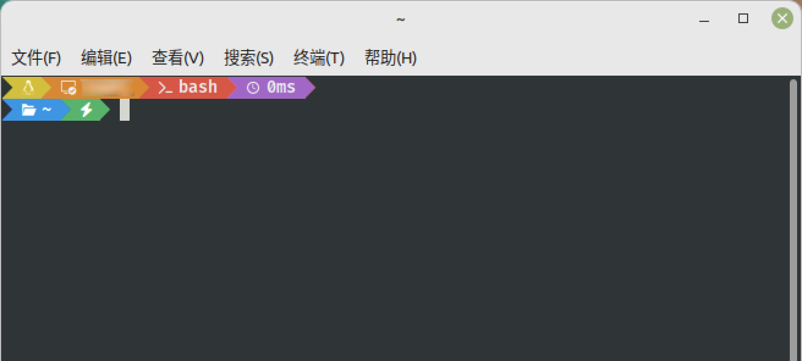

# xposh

 

## 项目简介

- 兼容万物的oh-my-posh主题

 

## 优点

- 科学的展示
- 美观的色调
- 顺手修复官方BUG
- 兼容这些系统：Windows、MasOS、Linux
- 兼容这些终端：Windows Terminal、CMD、Powershell、MSYS、iTerm、Termius、GNOME、VS Code
- 兼容这些命令处理器：Powershell、bash、zsh
- 兼容以上所有系统、终端、命令处理器的各种混搭
- 兼容powershell5和powershell7的语法，共用一个powershell脚本，方便统一维护和二开
- 兼容bash和zsh的语法，共用一个linux shell脚本，方便统一维护和二开
- powershell和linux shell编码逻辑尽量一致，方便统一维护和二开
- omp主题和omp.minimal主题结构一致，方便统一维护和二开
- 非常适合强迫症患者维护和二开

 

## 效果图

| 系统 | 终端 | 命令处理器 | 展示 |
| --- | --- | --- | --- |
| Windows | Windows Terminal | Powershell |  |
| Windows | Powershell | Powershell |  |
| Windows | CMD | Powershell |  |
| Windows | MSYS | bash |  |
| Windows | Windows Terminal + MSYS | bash |  |
| MacOS | iTerm | zsh |  |
| MacOS | Termius | zsh |  |
| MacOS | VS Code | zsh |  |
| LinuxMint | GNOME | bash |  |
